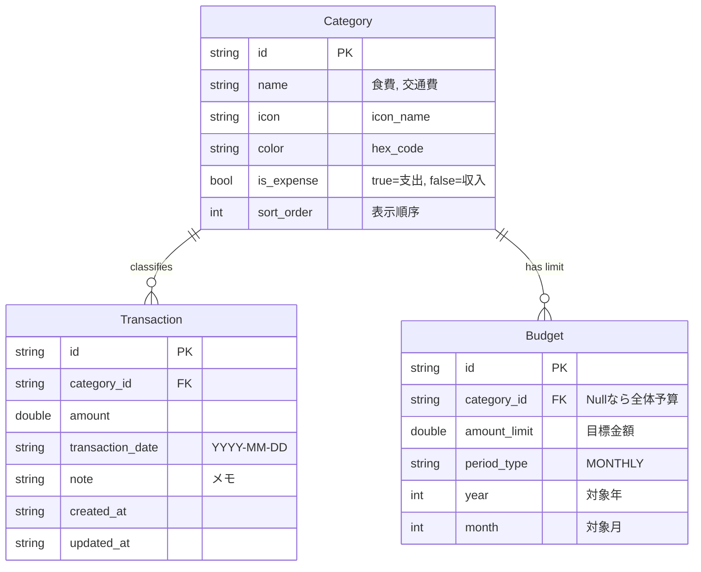

# 家計簿アプリ (Smart Ledger) 詳細設計書

## 技術スタック
- **フレームワーク**: Flutter (Dart)
- **データベース**: SQLite (sqflite)
- **状態管理**: Provider
- **グラフ**: fl_chart
- **対応プラットフォーム**: iOS, Android

---

## 1. データモデル設計 (Database Schema)

全ての基盤となるデータの構造です。
「目標達成率」と「予測」を実現するために、**支出（Transaction）**だけでなく、**予算（Budget）**の管理が不可欠です。

### ER図 (Entity Relationship Diagram)



### 設計のポイント
- **Budget (予算) テーブル**: カテゴリごとの予算設定も、月全体の予算設定も可能な構造（category_idがNullなら全体予算）
- **Category (分類) テーブル**: ユーザーが自由にカテゴリを追加・編集できるよう、DB管理
- **シングルユーザー設計**: スマホローカルアプリのため、Userテーブルは省略

---

## 2. フォルダ構成

```
lib/
├── main.dart                    # アプリエントリポイント
├── models/                      # データモデル
│   ├── category.dart
│   ├── transaction.dart
│   └── budget.dart
├── services/                    # ビジネスロジック・DB操作
│   ├── database_helper.dart     # SQLite操作
│   └── analysis_service.dart    # 集計・予測ロジック
├── providers/                   # 状態管理
│   ├── category_provider.dart
│   ├── transaction_provider.dart
│   └── budget_provider.dart
├── screens/                     # 画面
│   ├── home_screen.dart         # ダッシュボード
│   ├── transaction_form_screen.dart  # 取引入力
│   ├── transaction_list_screen.dart  # 履歴一覧
│   ├── statistics_screen.dart   # グラフ・統計
│   ├── category_screen.dart     # カテゴリ管理
│   └── budget_screen.dart       # 予算設定
├── widgets/                     # 再利用可能なWidget
│   ├── summary_card.dart        # サマリーカード
│   ├── category_pie_chart.dart  # 円グラフ
│   ├── budget_progress_bar.dart # 予算進捗バー
│   ├── transaction_list_item.dart  # 取引リストアイテム
│   └── month_selector.dart      # 月選択
└── utils/                       # ユーティリティ
    ├── constants.dart           # 定数
    ├── theme.dart               # テーマ設定
    └── formatters.dart          # フォーマッター
```

---

## 3. 画面設計

### 3.1 ホーム画面 (Dashboard)
- 今月の支出合計
- 予算残高・消化率プログレスバー
- 月末着地予測
- カテゴリ別支出円グラフ
- 直近の取引リスト（5件）

### 3.2 取引入力画面
- 金額入力（テンキー）
- カテゴリ選択（アイコングリッド）
- 日付選択
- メモ入力
- 収入/支出切り替え

### 3.3 取引履歴画面
- 月別フィルター
- 取引リスト（日付でグループ化）
- スワイプで削除
- タップで編集

### 3.4 統計画面
- 月選択
- カテゴリ別円グラフ
- 日別推移グラフ
- カテゴリ別ランキング

### 3.5 カテゴリ管理画面
- カテゴリ一覧
- 追加・編集・削除
- アイコン・色選択

### 3.6 予算設定画面
- 月間予算設定
- カテゴリ別予算設定

---

## 4. 予測ロジック

```dart
/// 月末支出予測（線形予測）
/// 計算式: (現在の合計 / 経過日数) × 月の総日数
class AnalysisService {
  double predictMonthlyTotal({
    required double currentTotal,
    required int daysElapsed,
    required int daysInMonth,
  }) {
    if (daysElapsed == 0) return 0.0;
    final dailyAvg = currentTotal / daysElapsed;
    return dailyAvg * daysInMonth;
  }
}
```

---

## 5. 使用パッケージ

| パッケージ | 用途 |
|-----------|------|
| sqflite | SQLiteデータベース |
| path_provider | ファイルパス取得 |
| provider | 状態管理 |
| fl_chart | グラフ表示 |
| intl | 日付・通貨フォーマット |
| uuid | ユニークID生成 |

---

## 6. 開発フェーズ (Roadmap)

### Phase 1: 「記録する」 (MVP)
- [ ] データベース設計・実装
- [ ] 取引の追加・編集・削除
- [ ] 取引履歴一覧表示
- **目標**: 自分の支出をDBに保存し、取り出せること

### Phase 2: 「現状を知る」
- [ ] ダッシュボード実装
- [ ] カテゴリ別円グラフ
- [ ] 予算設定・残高表示
- **目標**: 「今月あといくら使えるか」が分かること

### Phase 3: 「未来を予測する」
- [ ] 月末着地予測の実装
- [ ] 予算超過アラート
- [ ] 日別推移グラフ
- **目標**: 「このままだと赤字になる」警告が出ること

---

## 7. デフォルトカテゴリ

### 支出カテゴリ
| 名前 | アイコン | 色 |
|------|---------|-----|
| 食費 | restaurant | #FF5722 |
| 交通費 | directions_car | #2196F3 |
| 日用品 | shopping_cart | #4CAF50 |
| 娯楽 | sports_esports | #9C27B0 |
| 医療 | local_hospital | #F44336 |
| 通信費 | phone | #00BCD4 |
| 光熱費 | bolt | #FFC107 |
| その他 | more_horiz | #607D8B |

### 収入カテゴリ
| 名前 | アイコン | 色 |
|------|---------|-----|
| 給料 | account_balance_wallet | #4CAF50 |
| 副収入 | attach_money | #8BC34A |
| その他収入 | more_horiz | #607D8B |